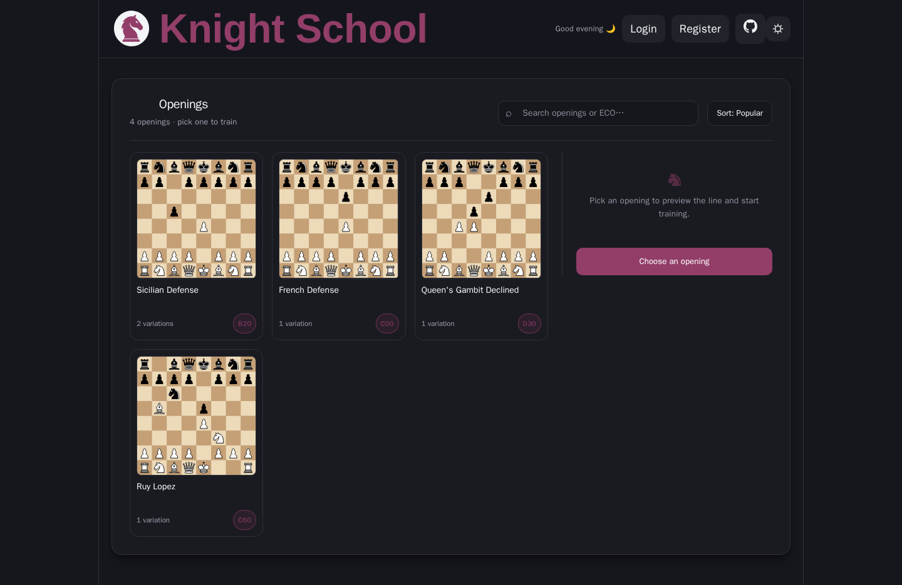

# ♟️ Knight School (Chess Trainer)

A web-based chess openings trainer designed to drill specific lines and track performance metrics.

This is a work in progress — see the [Roadmap](./ROADMAP.md) for planned work.

  
Light mode

  

  
Dark mode

  

### 📂 Project Navigation
- **[Backend](./backend/README.md)**: API logic, Database schema, and Chess engine rules.
- **[React frontend](./react/README.md)**: React components, State management, and UI/UX.
- **[Shared core](./packages/chess-core)**: Framework-neutral chess logic (`chess.js`) used by the frontend.
- **[Shared translations](./packages/i18n-locales)**: UI copy, one JSON file per locale, the single source of truth for translated strings.
- **[Infrastructure](./nginx)**: Nginx configuration and Docker orchestration.

---

## 🛠 Tech Stack
| Layer | Technologies |
| :--- | :--- |
| **Backend** | Python 3.12, FastAPI, SQLAlchemy, Alembic, `python-chess` |
| **Frontend** | React + Vite (`/`) |
| **Shared** | `@knight-school/chess-core` — framework-neutral chess logic (`chess.js`) used by the frontend |
| **Infrastructure** | PostgreSQL 16, Nginx, Docker |

---

## 🚀 Quick Start (Docker)

The fastest way to get Knight School running is via Docker.

### 1. Environment Setup

Copy the example environment file and fill in your secrets:

    cp .env.example .env

### 2. Launch the Stack

    docker compose up -d --build

### 3. Seed the Openings Library

Once the containers are running, populate the database with the chess openings:

    docker compose exec api python scripts/import_openings.py

### 4. Access the App

- **React frontend:** http://localhost (via Nginx)
- **API Documentation:** http://localhost:8000/docs

---

## 🏗 High-Level Architecture

Knight School uses a decoupled architecture to separate the chess engine from the user interface:

1. **Frontend:** [React](./react) at `/`, handling board visualization and user interaction.
2. **Backend:** A modular FastAPI server that validates moves against the `python-chess` library and manages user sessions in PostgreSQL.
3. **Reverse Proxy:** Nginx handles routing and serves the production frontend build. SSL is configured in the Nginx container (the repo’s default config points to self-signed certificate files).

### 🔁 Swappable frontends

The frontend talks to the backend via the **root-absolute `/api`**
path, and nginx (the single integration point) serves the SPA and proxies `/api/` to
FastAPI. Everything is **same-origin**, so there is **no CORS** and the backend is
frontend-agnostic.

**To add another frontend** (e.g. Vue, Svelte), follow the convention:

1. Create a **named folder** (e.g. `vue/`) whose app calls `/api` and serves under `/vue/`.
2. Add a **named compose service** in `docker-compose.yml` (build context `.`, its own
   dev-server port), mirroring the `react` service.
3. Add **one nginx `location /vue/` block** in [`nginx/default.conf`](nginx/default.conf)
   pointing at that service.
4. Add a CI workflow (copy `.github/workflows/react.yml`).

No backend changes are ever required.

### 🧩 Shared chess logic (`packages/chess-core`)

The framework-neutral chess logic — FEN handling, move validation, and opening-preview
positions, all built on `chess.js` with **no** framework code — lives in a standalone package,
[`@knight-school/chess-core`](./packages/chess-core). The frontend pulls it in with a **`file:`
dependency**. The package builds to an ESM bundle + type declarations and is unit-tested
against real `chess.js` independently of the UI, so the UI only tests its own wiring
(mocking the package boundary).

---

## 🤝 Contribution

- **Development:** Please refer to the [Backend](./backend/README.md) and [React](./react/README.md) guides for specific coding standards.
- **Commits:** Use conventional commits (`feat:`, `fix:`, `docs:`, `test:`).
- **PRs:** Ensure all new logic is covered by tests.

---

## 📜 Project Credits

- **Frontend:** React, React Router, Axios, Chess.js, cm-chessboard.
- **Backend:** FastAPI, SQLAlchemy, Python-Chess, Uvicorn, PyJWT, Pydantic.
