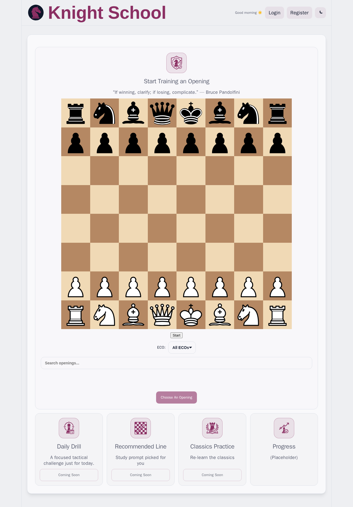
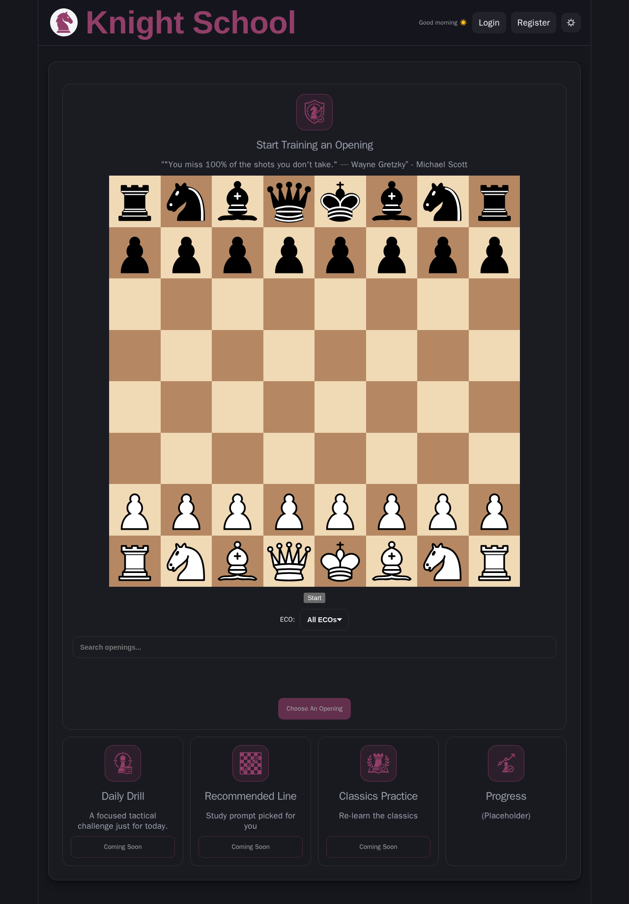

# ♟️ Knight School (Chess Trainer)

A web-based chess openings trainer designed to drill specific lines and track performance metrics.

This is a work in progress.

  
Light mode

  

  
Dark mode

  

### 📂 Project Navigation
- **[Backend](./backend/README.md)**: API logic, Database schema, and Chess engine rules.
- **[Frontend](./frontend/README.md)**: React components, State management, and UI/UX.
- **[Infrastructure](./nginx)**: Nginx configuration and Docker orchestration.

---

## 🛠 Tech Stack
| Layer | Technologies |
| :--- | :--- |
| **Backend** | Python 3.12, FastAPI, SQLAlchemy, Alembic, `python-chess` |
| **Frontend** | TypeScript, React, Vite, `chess.js`, `react-chessboard` |
| **Infrastructure** | PostgreSQL 16, Nginx, Docker |

---

## 🚀 Quick Start (Docker)

The fastest way to get Knight School running is via Docker.

### 1. Environment Setup

Copy the example environment file and fill in your secrets:

    cp .env.example .env

### 2. Launch the Stack

    docker compose up -d --build

### 3. Seed the Openings Library

Once the containers are running, populate the database with the chess openings:

    docker compose exec api python scripts/import_openings.py

### 4. Access the App

- **Web Interface:** http://localhost (via Nginx)
- **API Documentation:** http://localhost:8000/docs

---

## 🏗 High-Level Architecture

Knight School uses a decoupled architecture to separate the chess engine from the user interface:

1. **Frontend:** A React SPA that handles the board visualization and user interaction.
2. **Backend:** A modular FastAPI server that validates moves against the `python-chess` library and manages user sessions in PostgreSQL.
3. **Reverse Proxy:** Nginx handles routing and serves the production frontend build. SSL is configured in the Nginx container (the repo’s default config points to self-signed certificate files).

---

## 🤝 Contribution

- **Development:** Please refer to the [Backend](./backend/README.md) and [Frontend](./frontend/README.md) guides for specific coding standards.
- **Commits:** Use conventional commits (`feat:`, `fix:`, `docs:`, `test:`).
- **PRs:** Ensure all new logic is covered by tests.

---

## 📜 Project Credits

- **Frontend:** React, React Router, Axios, Chess.js, React-Chessboard.
- **Backend:** FastAPI, SQLAlchemy, Python-Chess, Uvicorn, PyJWT, Pydantic.
