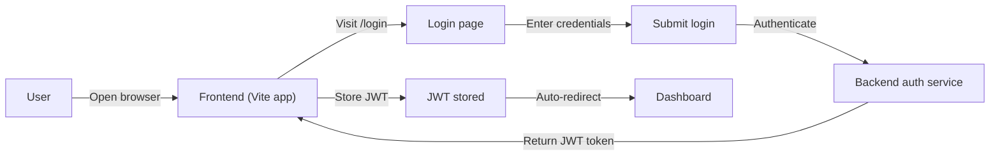
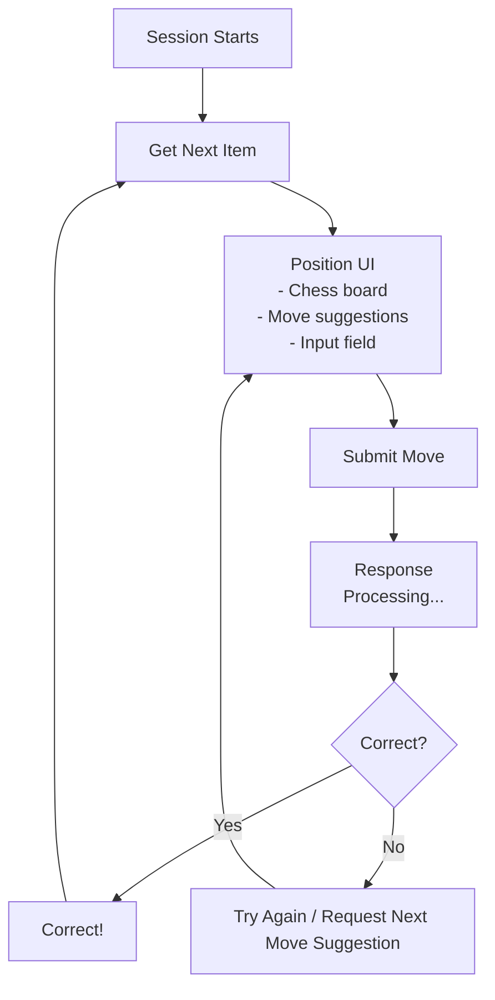

# Frontend - Chess Openings Trainer

## 🚀 Project Overview

TypeScript + React application for a chess openings training platform, providing interactive position-based drills with real-time validation.

## 📦 Project Structure

```
frontend/
├── src
│   ├── components          # Reusable UI elements
│   │   ├── Header
│   │   ├── Chessboard      # Interactive chess board
│   │   ├── MoveSelector    # UCI move input with autocomplete
│   │   └── FeedbackModal   # Result feedback display
│   ├── pages               # Page-level components
│   │   ├── Login
│   │   ├── Register
│   │   ├── Dashboard
│   │   └── Training        # Core training interface
│   ├── services            # API calls and data handling
│   │   ┈── api.ts          # Base API configuration
│   │   └── training.ts     # Training session-related API calls
│   ├── types               # Type definitions
│   │   ├── chess.d.ts      # Chess-specific types (positions, moves)
│   │   └── training.d.ts   # Training session types
│   ├── hooks               # Custom React hooks
│   │   └── useTrainingSession.ts
│   └── styles              # CSS and theme
│       └── index.css
├── vite.config.ts          # Vite configuration
└── tsconfig.json           # TypeScript configuration
```

## 🚧 Development Setup

### Requirements

| Software | Version |
|----------|---------|
| Node.js | LTS (v20.x or higher) |
| npm | 9.x or higher |

### Installation & Setup

```bash
# Navigate to frontend directory
cd frontend

# Install dependencies
npm install

# Start development server
npm run dev
```

### Development Server Details

```
Dev Server: http://localhost:5173 (Vite)
Backend API: proxied to http://localhost:8000 via /api
WebSockets: proxied to ws://localhost:8000/vs (for HMR)
```

## 🔄 Key Features

### Authentication Flow



### Training Session Flow



## 🧩 Core Components

### Chess Board Component

```tsx
// src/components/Chessboard.tsx - Excerpt
export function Chessboard({ fen, onMoveSelect }: ChessboardProps) {
  // ...
  
  return (
    <div className="chess-board">
      {/* Board rendering */}
      {fen && <BoardCanvas fen={fen} />}
      
      {/* Move suggestions popup */}
      {suggestedMoves.length > 0 && (
        <MoveSuggestions 
          moves={suggestedMoves} 
          onSelect={handleMoveSelect}
        />
      )}
    </div>
  )
}
```

### Move Selector Component

```tsx
// src/components/MoveSelector.tsx - Excerpt
export function MoveInput({ fen, onSubmit }: MoveInputProps) {
  const { board } = chessEngine(fen)
  
  // Generate valid moves
  const validMoves = generateValidMoves(board)
  
  return (
    <input
      type="text"
      placeholder={`Enter move (UCI notation)...`}
      className={`move-input ${validMoves.length > 0 ? 'suggestions-available' : ''}`}
      disabled={!board}
    />
  )
}
```

### Feedback Modal

```tsx
// src/components/FeedbackModal.tsx - Excerpt
export function FeedbackModal({ 
  isOpen, 
  onClose,
  result: { correct, reason, fenAfter } 
}: FeedbackProps) {
  return (
    <div className={`feedback-modal ${isOpen ? 'open' : 'closed'}`}>
      <div className="modal-content">
        <h3>{correct ? 'Correct!' : 'Wrong move'}</h3>
        
        {reason && <p>Reason: {reason}</p>}
        
        {fenAfter && (
          <div className="position-preview">
            <strong>New position (FEN):</strong>
            <pre>{fenAfter}</pre>
          </div>
        )}
        
        <button onClick={onClose}>Continue</button>
      </div>
    </div>
  )
}
```

## 📡 API Interaction

### Request/Response Specifications

#### GET /api/training-sessions/:id/next

**Request:**
```http
GET /api/training-sessions/${sessionId}/next HTTP/1.1
Authorization: Bearer <JWT Token>
Accept: application/json
```

**Response (200 OK):**

```json
{
  "session_id": 42,
  "item_id": 7,
  "order_index": 3,
  "fen": "rnbqkbnr/ppp2ppp/4p3/8/8/8/PPP2PPP/RNBQKBNR b KQkq - 0 1",
  "move_count_limit": 3,
  "opening_eco": "B02",
  "opening_name": "Scandinavian Defense"
}
```

**Response (404 Not Found):**

```json
{
  "detail": "No more items available in this session."
}
```

#### POST /api/training-sessions/:id/responses

**Request:**
```http
POST /api/training-sessions/${sessionId}/responses HTTP/1.1
Authorization: Bearer <JWT Token>
Content-Type: application/json
```

```json
{
  "move_uci": "e7e5",
  "
}
```