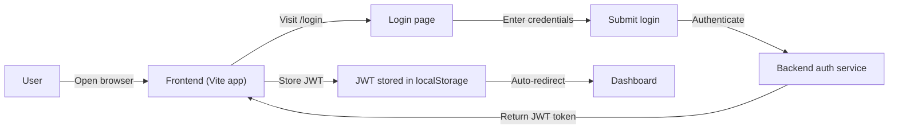
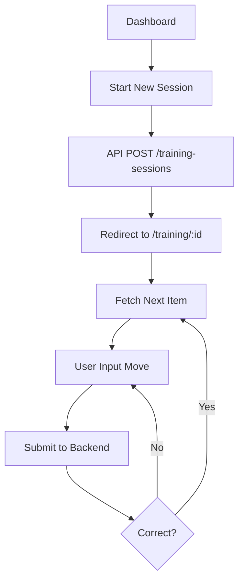

# 🎨 Knight School Frontend

The frontend for Knight School is a TypeScript + React application providing an interactive, position-based chess drilling interface with real-time move validation.

### 📂 Project Navigation
- **[Root](./README.md)**: Full-stack overview and Docker orchestration.
- **[Backend](../backend/README.md)**: API logic, DB schema, and Chess engine rules.

---

## 📦 Project Structure

```text
frontend/
├── src/
│   ├── components/         # Reusable UI elements (Buttons, Header, ThemeToggle)
│   ├── pages/              # Page-level components (Login, Dashboard, Training)
│   ├── hooks/              # Custom logic (useTrainingSession, useBlinkGreen)
│   ├── api.ts              # Axios configuration & API interceptors
│   ├── App.tsx             # Main routing and layout
│   └── index.css           # Global styles
├── public/                 # Static assets
├── vite.config.ts          # Vite configuration
└── tsconfig.json           # TypeScript configuration
```

---

## 🚧 Development Setup

### 1. Local UI Development (Recommended for Iteration)
If you are working on UI/UX and want **Hot Module Replacement (HMR)**, run the frontend locally while keeping the backend in Docker.

**Prerequisites:** Node.js $\ge$ 20.x

```bash
# 1. Ensure the backend is running in Docker
docker compose up -d db api

# 2. Install and start frontend
cd frontend
npm install
npm run dev
```

### 2. Full-Stack Docker Setup
To run the production-ready build served via Nginx:
```bash
docker compose up -d --build
```

### 🌐 Network Architecture
The application is designed to run behind an **Nginx reverse proxy** to avoid CORS issues:

- **Frontend Server:** `http://localhost:5173` (Vite Dev) $\rightarrow$ `http://localhost` (Nginx Prod).
- **API Gateway:** Requests to `/api/` are routed by Nginx to the FastAPI backend (`http://api:8000`).
- **Authentication:** JWTs are stored in `localStorage` and attached to every request via an Axios interceptor in `api.ts`.

---

## 🔄 Key Logic Flows

### Authentication Flow


### Training Session Flow


---

## 🧩 Core Implementation Details

### API Client (`src/api.ts`)
The app uses a centralized Axios instance to ensure consistent communication with the backend:
- **Base URL:** `/api` (proxied by Nginx).
- **Authorization:** A request interceptor automatically injects the `Authorization: Bearer <token>` header if a JWT exists in storage.

### Training Logic (`src/pages/Training.tsx`)
The training experience is driven by the `useTrainingSession` hook, which synchronizes the local board state with the backend's session state.
- **Board UI:** `react-chessboard`
- **Move Logic:** `chess.js` for client-side validation before sending to the API.

---

## 📡 Integration Contracts

*For a full list of endpoints, see the [Backend README](../backend/README.md).*

### Fetch Next Move
`GET /api/training-sessions/:id/next`
**Response:**
```json
{
  "session_id": 42,
  "item_id": 7,
  "fen": "rnbqkbnr/ppp2ppp/4p3/8/8/8/PPP2PPP/RNBQKBNR b KQkq - 0 1",
  "opening_name": "Scandinavian Defense"
}
```

### Submit Move
`POST /api/training-sessions/:id/responses`
**Request:**
```json
{
  "move_uci": "e7e5"
}
```
