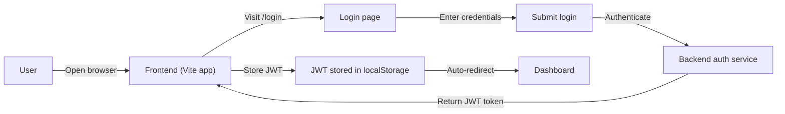
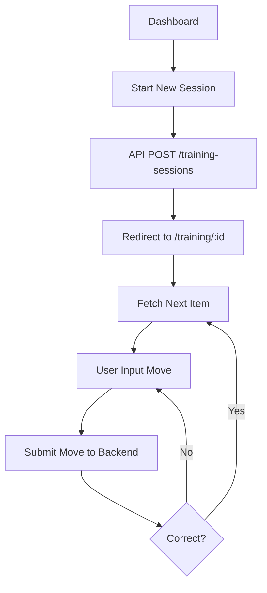

# 🎨 Knight School (Chess Trainer) Frontend

The frontend for chess-trainer is a TypeScript + React application providing an interactive, position-based chess drilling interface with real-time move validation.

## 📂 Project Navigation

- **Root**: Full-stack overview and Docker orchestration.
- **Backend**: API logic, DB schema, and chess engine rules.

## 📦 Project Structure

```text
frontend/
├── src/
│   ├── components/         # Reusable UI elements
│   ├── pages/              # Page-level components (Login, Register, Dashboard, Training)
│   ├── hooks/              # Custom logic (useTrainingSession, useBlinkGreen)
│   ├── api.ts              # Axios configuration & API interceptors
│   ├── App.tsx             # Main routing and layout
│   └── index.css           # Global styles
├── public/                 # Static assets
├── vite.config.ts          # Vite configuration
└── tsconfig.json         # TypeScript configuration
```

## 🚧 Development Setup

### 1. Local UI Development (Recommended for Iteration)

If you are working on UI/UX and want Hot Module Replacement (HMR), run the frontend locally while keeping the backend in Docker.

**Prerequisites:** Node.js >= 20.x

```bash
# 1. Ensure the backend is running in Docker
docker compose up -d db api

# 2. Install and start frontend
cd frontend
npm install
npm run dev
```

### 2. Full-Stack Docker Setup

To run the production-ready build served via Nginx:

```bash
docker compose up -d --build
```

## 🌐 Network Architecture

The application expects API requests to be served under the `/api` path (the frontend Axios client uses `baseURL: "/api"`).

- **Base path for frontend API calls:** `/api`
- **Authorization:** JWTs are stored in `localStorage` and attached to requests via an Axios request interceptor in `src/api.ts`.

## 🔄 Key Logic Flows

### Authentication Flow


```mermaid
flowchart LR
  U["User"] -->|Open browser| FE["Frontend (Vite app)"]
  FE -->|Visit /login| L["Login page"]
  L -->|Enter credentials| LF["Submit login"]
  LF -->|Authenticate| BE["Backend auth service"]
  BE -->|Return JWT token| FE
  FE -->|Store JWT| J["JWT stored in localStorage"]
  J -->|Auto-redirect| D["Dashboard"]
```

### Training Session Flow


```mermaid
flowchart TD
  A[Dashboard] --> B[Start New Session]
  B --> C[API POST /training-sessions]
  C --> D[Redirect to /training/:id]
  D --> E[Fetch Next Item]
  E --> F[User Input Move]
  F --> G[Submit Move to Backend]
  G --> H{Correct?}
  H -- Yes --> E
  H -- No --> F
```

## 🧩 Core Implementation Details

### API Client (`src/api.ts`)

The app uses a centralized Axios instance to communicate with the backend:

- **Base URL:** `/api`
- **Authorization:** request interceptor injects `Authorization: Bearer <token>` from `localStorage` (key: `token`)
- **401 handling:** on `401`, the client attempts to refresh using `refresh_token` from `localStorage` by calling `POST /auth/refresh`

### Training Logic (`src/pages/Training.tsx` + `src/hooks/useTrainingSession.ts`)

The training experience is driven by `useTrainingSession`, which:

- loads the current training item by calling `GET training-sessions/:id/next`
- validates and submits moves via `POST training-sessions/:id/responses`
- updates the local FEN and the “correctMoveUci” based on backend responses
- optionally auto-advances during autoplay when it’s the opponent’s turn (uses `chess.js` to check turn)

## 📡 Integration Contracts

### Fetch Next Move

`GET /api/training-sessions/:id/next`

Example response (fields may vary):

```json
{
  "itemId": 7,
  "fenAfter": "rnbqkbnr/ppp2ppp/4p3/8/8/8/PPP2PPP/RNBQKBNR b KQkq - 0 1",
  "openingName": "Scandinavian Defense",
  "openingEco": "B01",
  "correctMoveUci": "e7e5",
  "pgn": "",
  "epd": ""
}
```

The frontend derives:
- FEN from `fenAfter` (or fallback to `fen` / `epd`)
- item id from `itemId` (or fallback to `id`)
- correct move from `correctMoveUci`

### Submit Move

`POST /api/training-sessions/:id/responses`

Example request:

```json
{
  "moveUci": "e7e5",
  "itemId": 7
}
```

### Move Feedback

On correct moves, the frontend expects the backend response to contain:
- `correct: true`
- optionally `fenAfter` and `sessionCompleted: true`

On incorrect moves, the frontend expects:
- `correct: false` and an error `reason` (used to build feedback UI)

If you want, paste the **actual frontend/README.md text** you want updated (or tell me the exact repo + path you’re editing locally), and I’ll produce a cleaned, corrected replacement README without any formatting issues.