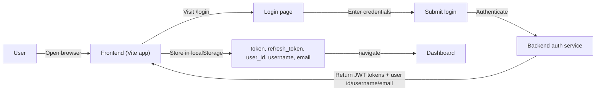
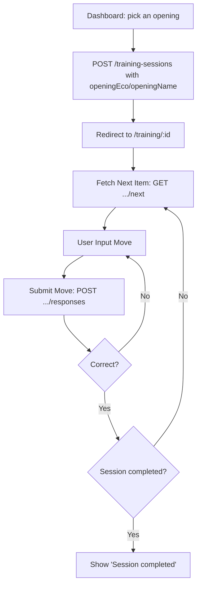

# 🎨 Knight School (Chess Trainer) Frontend

The frontend for chess-trainer is a TypeScript + React application providing an interactive, position-based chess drilling interface with real-time move validation.

## 📂 Project Navigation

- **Root**: Full-stack overview and Docker orchestration.
- **Backend**: API logic, DB schema, and chess engine rules.

## 📦 Project Structure

```text
frontend/
├── src/
│   ├── components/            # Reusable UI elements (Header, Button, icons, theme toggle...)
│   │   └── openings/          # BoardPreview, OpeningCombo, DashboardTile
│   ├── pages/                 # Login, Register, Dashboard, Training (+ *.test.tsx alongside each)
│   ├── hooks/                 # useTrainingSession, useBlinkGreen (+ *.test.ts alongside each)
│   ├── tests/
│   │   └── msw/                # Mock Service Worker handlers/server for API mocking in tests
│   ├── assets/                 # SVG/JPG art used by dashboard tiles and icons
│   ├── api.ts                  # Axios instance, auth header injection, 401 refresh interceptor
│   ├── auth.ts                 # logout() — clears all auth-related localStorage keys
│   ├── RequireAuth.tsx         # Route guard: calls GET /auth/me, redirects to /login on failure
│   ├── App.tsx                 # Routes: /login, /register, /dashboard, /training/:id, * -> Dashboard
│   ├── main.tsx                # React root / entrypoint
│   └── index.css               # Global styles (imports src/styles/*.css)
├── public/                     # favicon.svg, quotes.txt (static assets)
├── playwright-dashboard.spec.ts  # Playwright E2E spec
├── vite.config.ts               # Vite configuration
├── vitest.config.ts             # Vitest configuration (jsdom, MSW-backed unit tests)
└── tsconfig.json                # TypeScript configuration
```

## 🚧 Development Setup

### 1. Local UI Development (Recommended for Iteration)

If you are working on UI/UX and want Hot Module Replacement (HMR), run the frontend locally while keeping the backend in Docker.

**Prerequisites:** Node.js >= 20.x

```bash
# 1. Ensure the backend is running in Docker
docker compose up -d db api

# 2. Install and start frontend
cd frontend
npm install
npm run dev
```

### 2. Full-Stack Docker Setup

To run the production-ready build served via Nginx:

```bash
docker compose up -d --build
```

## 🧪 Testing

- **Unit/component tests:** `npm run test` (Vitest + Testing Library + jsdom). API calls are mocked via MSW (`src/tests/msw/`), not a live backend.
- **Watch mode:** `npm run test:watch`
- **E2E:** `npm run test:playwright` (runs `playwright-dashboard.spec.ts`; the Docker image is built from `mcr.microsoft.com/playwright:v1.62.0-jammy` so browsers are preinstalled in the container).
- **Lint:** `npm run lint` (ESLint, including `eslint-plugin-playwright` for the E2E spec).

## 🌐 Network Architecture

The application expects API requests to be served under the `/api` path (the frontend Axios client uses `baseURL: "/api"`).

- **Base path for frontend API calls:** `/api`
- **Authorization:** on login, the access token, refresh token, `user_id`, `username`, and `email` are all written to `localStorage` (see `src/pages/Login.tsx`). The Axios request interceptor in `src/api.ts` attaches `Authorization: Bearer <token>` from the `token` key; `Header.tsx` reads `username` back out to render the greeting. `auth.ts#logout()` clears all five keys.

## 🔄 Key Logic Flows

### Authentication Flow


```mermaid
flowchart LR
  U["User"] -->|Open browser| FE["Frontend (Vite app)"]
  FE -->|Visit /login| L["Login page"]
  L -->|Enter credentials| LF["Submit login"]
  LF -->|Authenticate| BE["Backend auth service"]
  BE -->|Return JWT tokens + user id/username/email| FE
  FE -->|Store in localStorage| J["token, refresh_token, user_id, username, email"]
  J -->|navigate| D["Dashboard"]
```

`RequireAuth` (wrapping `/dashboard` and `/training/:id`) independently calls `GET /auth/me` on
mount and redirects to `/login` if that fails — it doesn't just trust the presence of a token in
`localStorage`.

### Training Session Flow


```mermaid
flowchart TD
  A[Dashboard: pick an opening] --> B[POST /training-sessions with openingEco/openingName]
  B --> C[Redirect to /training/:id]
  C --> D[Fetch Next Item: GET .../next]
  D --> E[User Input Move]
  E --> F[Submit Move: POST .../responses]
  F --> G{Correct?}
  G -- Yes --> H{Session completed?}
  H -- No --> D
  H -- Yes --> I[Show 'Session completed']
  G -- No --> E
```

## 🧩 Core Implementation Details

### API Client (`src/api.ts`)

The app uses a centralized Axios instance to communicate with the backend:

- **Base URL:** `/api`
- **Authorization:** request interceptor injects `Authorization: Bearer <token>` from `localStorage` (key: `token`)
- **401 handling:** on `401`, the client attempts to refresh using `refresh_token` from `localStorage` by calling `POST /auth/refresh`, retries the original request once, and if the refresh itself fails, clears both tokens and hard-navigates to `/login`.

### Training Logic (`src/pages/Training.tsx` + `src/hooks/useTrainingSession.ts`)

The training experience is driven by `useTrainingSession`, which:

- loads the current training item by calling `GET training-sessions/:id/next`
- validates and submits moves via `POST training-sessions/:id/responses`
- updates the local FEN and `correctMoveUci` based on backend responses; `correctMoveUci` powers `Training.tsx`'s hint feature (highlighting the from/to squares) — it is *not* debug-only output despite a stale comment to that effect in a backend test
- optionally auto-advances during autoplay when it's the opponent's turn (uses `chess.js` to check turn)

## 📡 Integration Contracts

### Fetch Next Move

`GET /api/training-sessions/:id/next`

Actual backend response shape (`TrainingNextResponse`, camelCased):

```json
{
  "sessionId": 42,
  "itemId": 7,
  "orderIndex": 1,
  "fen": "rnbqkbnr/ppp2ppp/4p3/8/8/8/PPP2PPP/RNBQKBNR b KQkq - 0 1",
  "moveCountLimit": null,
  "openingEco": "B01",
  "openingName": "Scandinavian Defense",
  "correctMoveUci": "e7e5"
}
```

The frontend derives:
- FEN from `data.fen` in practice — `useTrainingSession.ts` also falls back to `data.fenAfter`/`data.epd`, but the `/next` endpoint never actually sends those, so that fallback path is currently dead
- item id from `data.itemId` (falls back to `data.id`, also unused by this endpoint)
- correct move from `data.correctMoveUci`

`useTrainingSession`'s `NextItem` also carries `nextPgn`/`nextEpd` (read from `data.pgn`/`data.epd`, which are likewise never present on this endpoint) and a `nextNextPgn` field that's declared but never populated at all. None of the three are read anywhere downstream (`Training.tsx` doesn't reference them) — this looks like scaffolding for a not-yet-wired feature (an "opening complete, preview the next one" hint, matching a `feat(training): add optional nextNextPgn to NextItem` changelog entry) rather than a bug, so it hasn't been removed — but don't assume it does anything today.

### Submit Move

`POST /api/training-sessions/:id/responses`

Example request:

```json
{
  "moveUci": "e7e5",
  "itemId": 7
}
```

### Move Feedback

Actual backend response shape (`MoveResponseResponse`, camelCased):

```json
{
  "correct": true,
  "reason": "correct move",
  "fenAfter": "...",
  "sessionCompleted": false
}
```

On correct moves, `fenAfter` updates the board and, if `sessionCompleted` is true, the UI shows a completion state instead of advancing. On incorrect moves, `correct` is `false`, `fenAfter` is `null`, and `reason` (e.g. `"illegal move"`, `"wrong move"`) drives the feedback message.

## ⚠️ Known Gap

`Header.tsx` renders a link to `/profile`, but `App.tsx` has no `/profile` route — it falls through to the catch-all (`path="*"`) and silently renders the Dashboard instead. There's no `Profile` page component yet.
