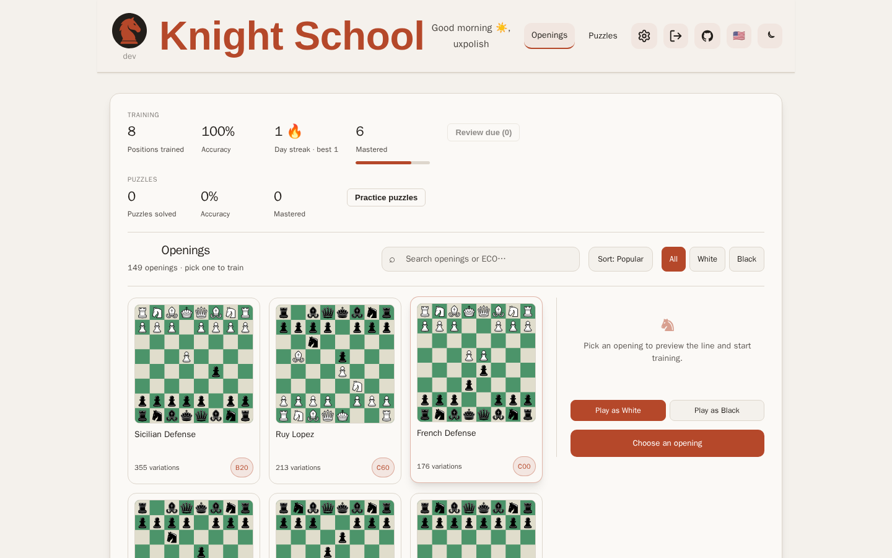
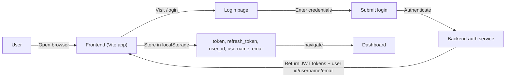
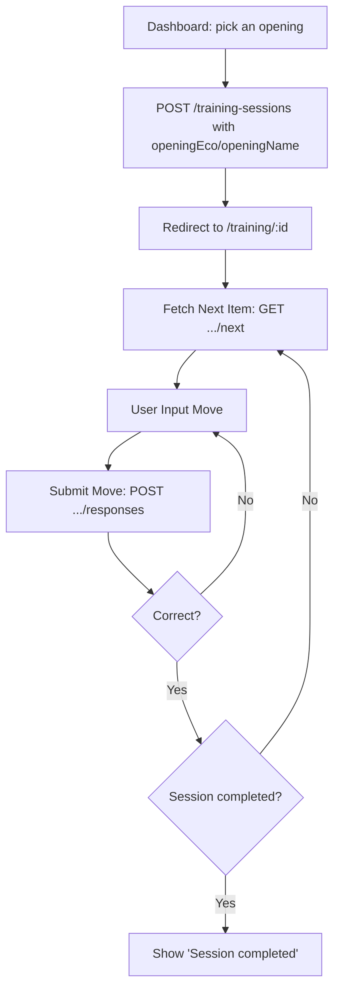

# 🎨 Knight School (Chess Trainer) — React Frontend

> One of two interchangeable frontends against the same `/api` backend (the other is [`../angular`](../angular/README.md)). Served by nginx at `/`.

The frontend for chess-trainer is a TypeScript + React application providing an interactive, position-based chess drilling interface with real-time move validation.

## 📸 Screenshots

<details>
<summary>Show dashboard screenshot</summary>

<picture>
  <source media="(prefers-color-scheme: dark)" srcset="dashboard-dark-1440.png">
  
</picture>

<sub>Desktop (1440px); follows your GitHub light/dark theme. Rendered by <code>playwright-dashboard.spec.ts</code>, which also captures the training page and tablet/mobile variants locally; regenerate with <code>npm run test:playwright</code>.</sub>

</details>

## 📂 Project Navigation

- **Root**: Full-stack overview and Docker orchestration.
- **Backend**: API logic, DB schema, and chess engine rules.

## 📦 Project Structure

```text
react/
├── src/
│   ├── components/            # Reusable UI elements (Board, Header, Button, icons, theme toggle...)
│   │   ├── Board.tsx           # cm-chessboard wrapper (the seam the Angular board mirrors)
│   │   └── openings/          # BoardPreview, OpeningCombo, DashboardTile
│   ├── pages/                 # Login, Register, Dashboard, Training, VerifyEmail, Puzzles (+ *.test.tsx alongside each)
│   ├── hooks/                 # useTrainingSession, useBlinkGreen, useSound (+ *.test.ts alongside each)
│   ├── utils/                 # sound.ts (feedback sound utilities)
│   ├── tests/
│   │   └── msw/                # Mock Service Worker handlers/server for API mocking in tests
│   ├── assets/                 # SVG/JPG art used by dashboard tiles and icons
│   ├── api.ts                  # Axios instance, auth header injection, 401 refresh interceptor
│   ├── auth.ts                 # logout() — clears all auth-related localStorage keys
│   ├── cm-chessboard.d.ts      # Ambient types for cm-chessboard (the package ships none)
│   ├── RequireAuth.tsx         # Route guard: calls GET /auth/me, redirects to /login on failure
│   ├── App.tsx                 # Routes: /login, /register, /dashboard, /training/:id, /verify-email, /puzzles, * -> Dashboard
│   ├── main.tsx                # React root / entrypoint
│   └── index.css               # Global styles (imports src/styles/*.css)
│   └── i18n/                   # react-i18next config + locales/*.json translation resources
├── public/                     # favicon.svg, quotes.txt, cm-chessboard-assets/ (board sprites), sounds/ (feedback audio)
├── playwright-dashboard.spec.ts  # Playwright E2E spec
├── vite.config.ts               # Vite configuration
├── vitest.config.ts             # Vitest configuration (jsdom, MSW-backed unit tests)
└── tsconfig.json                # TypeScript configuration
```

## 🚧 Development Setup

### 1. Local UI Development (Recommended for Iteration)

If you are working on UI/UX and want Hot Module Replacement (HMR), run the frontend locally while keeping the backend in Docker.

**Prerequisites:** Node.js >= 20.x

```bash
# 1. Ensure the backend is running in Docker
docker compose up -d db api

# 2. Install and start frontend
cd react
npm install
npm run dev
```

### 2. Full-Stack Docker Setup

To run the production-ready build served via Nginx:

```bash
docker compose up -d --build
```

## 🧪 Testing

- **Unit/component tests:** `npm run test` (Vitest + Testing Library + jsdom). API calls are mocked via MSW (`src/tests/msw/`), not a live backend.
- **Watch mode:** `npm run test:watch`
- **E2E:** `npm run test:playwright` (runs `playwright-dashboard.spec.ts`; the Docker image is built from `mcr.microsoft.com/playwright:v1.62.0-jammy` so browsers are preinstalled in the container).
- **Prod smoke test:** `npm run test:smoke` (runs `playwright-prod-smoke.spec.ts` against `https://knightschool.click` by default, override with `BASE_URL`). Logs into the persistent `smoketest-persistent` account and walks dashboard → puzzles to confirm a real deploy actually works, without registering a fresh throwaway account each run. If that account ever needs recreating, run `playwright-prod-register.spec.ts` once with `SMOKE_USERNAME`/`SMOKE_PASSWORD` set (it's a no-op skip otherwise, and isn't part of `test:smoke`).
- **Lint:** `npm run lint` (ESLint, including `eslint-plugin-playwright` for the E2E spec).

## 🌐 Network Architecture

The application expects API requests to be served under the `/api` path (the frontend Axios client uses `baseURL: "/api"`).

- **Base path for frontend API calls:** `/api`
- **Authorization:** on login, the access token, refresh token, `user_id`, `username`, and `email` are all written to `localStorage` (see `src/pages/Login.tsx`). The Axios request interceptor in `src/api.ts` attaches `Authorization: Bearer <token>` from the `token` key; `Header.tsx` reads `username` back out to render the greeting. `auth.ts#logout()` clears all five keys.

## 🔄 Key Logic Flows

### Authentication Flow



`RequireAuth` (wrapping `/dashboard` and `/training/:id`) independently calls `GET /auth/me` on
mount and redirects to `/login` if that fails — it doesn't just trust the presence of a token in
`localStorage`.

### Training Session Flow



## 🧩 Core Implementation Details

### API Client (`src/api.ts`)

The app uses a centralized Axios instance to communicate with the backend:

- **Base URL:** `/api`
- **Authorization:** request interceptor injects `Authorization: Bearer <token>` from `localStorage` (key: `token`)
- **401 handling:** on `401`, the client attempts to refresh using `refresh_token` from `localStorage` by calling `POST /auth/refresh`, retries the original request once, and if the refresh itself fails, clears both tokens and hard-navigates to `/login`.

### Training Logic (`src/pages/Training.tsx` + `src/hooks/useTrainingSession.ts`)

The training experience is driven by `useTrainingSession`, which:

- loads the current training item by calling `GET training-sessions/:id/next`
- validates and submits moves via `POST training-sessions/:id/responses`
- updates the local FEN and `correctMoveUci` based on backend responses; `correctMoveUci` powers `Training.tsx`'s hint feature (highlighting the from/to squares) — it is *not* debug-only output despite a stale comment to that effect in a backend test
- optionally auto-advances during autoplay when it's the opponent's turn (uses `chess.js` to check turn)

### Audio Feedback (`src/hooks/useSound.ts` + `src/utils/sound.ts`)

The app provides real-time audio feedback for moves and training events via the `useSound` hook, which loads and plays sound files from `public/sounds/`. Sounds include move feedback (correct/incorrect on puzzles), piece interactions (move, capture, castle), and achievement/milestone notifications. The `sound.ts` utility exports the sound triggers (e.g., `playMoveSound()`, `playCorrectSound()`) consumed throughout the training and puzzle UI.

## 📡 Integration Contracts

### Fetch Next Move

`GET /api/training-sessions/:id/next`

Actual backend response shape (`TrainingNextResponse`, camelCased):

```json
{
  "sessionId": 42,
  "itemId": 7,
  "orderIndex": 1,
  "fen": "rnbqkbnr/ppp2ppp/4p3/8/8/8/PPP2PPP/RNBQKBNR b KQkq - 0 1",
  "moveCountLimit": null,
  "openingEco": "B01",
  "openingName": "Scandinavian Defense",
  "correctMoveUci": "e7e5"
}
```

The frontend derives:
- FEN from `data.fen` in practice — `useTrainingSession.ts` also falls back to `data.fenAfter`/`data.epd`, but the `/next` endpoint never actually sends those, so that fallback path is currently dead
- item id from `data.itemId` (falls back to `data.id`, also unused by this endpoint)
- correct move from `data.correctMoveUci`

`NextItem` is deliberately narrow — `nextFen`, `nextItemId`, `nextOpeningLabel`, `nextCorrectMoveUci`. (Earlier unused `nextPgn`/`nextEpd`/`nextNextPgn` scaffolding fields were removed.)

### Submit Move

`POST /api/training-sessions/:id/responses`

Example request:

```json
{
  "moveUci": "e7e5",
  "itemId": 7
}
```

### Move Feedback

Actual backend response shape (`MoveResponseResponse`, camelCased):

```json
{
  "correct": true,
  "reason": "correct move",
  "fenAfter": "...",
  "sessionCompleted": false
}
```

On correct moves, `fenAfter` updates the board and, if `sessionCompleted` is true, the UI shows a completion state instead of advancing. On incorrect moves, `correct` is `false`, `fenAfter` is `null`, and `reason` (e.g. `"illegal move"`, `"wrong move"`) drives the feedback message.

## 🌐 Internationalization (i18n)

The UI chrome (header, auth pages, dashboard, training, and puzzles pages) is localized via [`react-i18next`](https://react.i18next.com/), with translation resources in `src/i18n/locales/*.json` — over 30 locales including `en-US`, `es`, `fr`, `de`, `it`, `nl`, `pl`, `pt`, `pt-BR`, `ru`, `tr`, `zh-CN`, `ja`, `ko`, `hi`, `ar`, `cs`, `da`, `el`, `fi`, `he`, `hu`, `ms`, `no`, `ro`, `sk`, `sv`, `uk`, `vi`, `id`, plus novelty variants like `en-x-pirate`, `kl` (Klingon), and `en-x-groot`. `src/i18n/i18n.ts` initializes `i18next` (imported once in `main.tsx`, and again in `vitest.setup.ts` so component tests render real strings instead of raw keys), auto-discovers every `locales/*.json` file via `import.meta.glob` (no per-language wiring needed), and reads/writes the chosen language to `localStorage` under the `language` key, mirroring `ThemeToggle.tsx`'s pattern for `theme`.

`LanguageToggle.tsx` (in the header, next to the theme toggle) renders a `<select>` whose options are derived from the same auto-discovered language list, each shown as a flag emoji; picking one calls `i18n.changeLanguage()`.

`en-US.json` is the source of truth for translation *keys* — run `npm run i18n:sync` (`scripts/sync-locales.mjs`) after adding/renaming/removing a key there to propagate the structural change to every other locale file automatically (missing keys land as `"[TODO <lang>] ..."` stubs to fill in; stale keys get dropped). `npm run i18n:check` does the same as a read-only CI check. `src/i18n/locales.test.ts` fails if any locale is missing a key, has an empty value, or still has a `[TODO]` stub.

Shouts to Patricia, Maritza, and Maritza's husband for helping out with the Spanish translation!

**Not yet localized:**
- Opening and puzzle descriptive content (`src/data/openingText.ts` and backend-authored opening prose) — English-only for now.
- Status/feedback strings that live in `packages/chess-core` (`deriveStatus`, `classifyFeedback`, `splitOpeningLabel`) — e.g. "Your move", "Session completed", the "Training" fallback label. That package is consumed via its built `dist/`, so localizing it needs its own pass (edit `src`, `npm run build` in `packages/chess-core`, verify both frontends still pick up the change) rather than a one-off string swap.

## ⚠️ Known Gap

`Header.tsx` renders a link to `/profile`, but `App.tsx` has no `/profile` route — it falls through to the catch-all (`path="*"`) and silently renders the Dashboard instead. There's no `Profile` page component yet.
