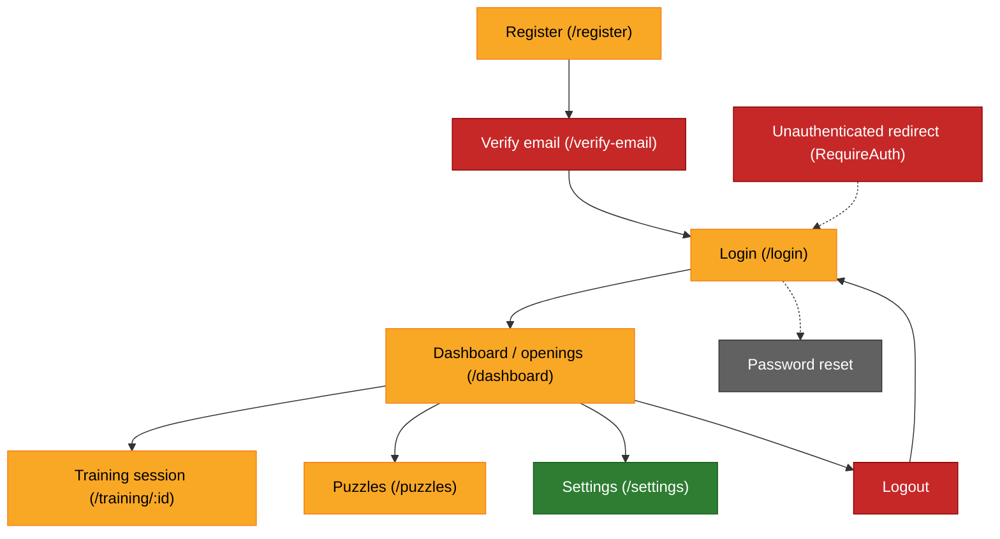

# E2E test coverage tracker

Playwright specs live in this directory. This doc maps the app's key user
flows (from `src/App.tsx` routes) to existing coverage and flags gaps.

## Flow map

Legend: 🟢 covered · 🟡 partial (loads/screenshots only, weak interaction coverage) · 🔴 gap (no test) · ⚪ feature not built.

## Flows and coverage

| Flow | Route(s) | Covered by | Notes |
|---|---|---|---|
| Register | `/register` | `playwright-prod-register.spec.ts` | One-off, prod-only, creates the persistent smoke account. Not run in regular suite. |
| Login | `/login` | `playwright-prod-smoke.spec.ts` | Only exercised as a means to reach the dashboard; no dedicated bad-password/validation-error test. |
| Email verification | `/verify-email` | none | **Gap.** No test loads this page, valid or invalid token. |
| Logout | (Header action) | none | **Gap.** No test clicks logout and confirms redirect to `/login` + route protection. |
| Dashboard / openings browse | `/dashboard` | `playwright-dashboard.spec.ts` | Screenshot-only across breakpoints/themes with mocked APIs; no interaction (e.g. clicking an opening to start training) is asserted. |
| Start training session | `/training/:id` | `playwright-dashboard.spec.ts` | Screenshot-only with mocked API; no test exercises an actual move being played, correct/incorrect feedback, or session completion. |
| Puzzles | `/puzzles` | `playwright-prod-smoke.spec.ts` | Confirms the page loads and a board renders; doesn't attempt a puzzle move or check right/wrong feedback. |
| Settings / preferences | `/settings` | `playwright-settings-preview-check.spec.ts` | Covers board theme, piece set, coordinates toggle, orientation toggle with live preview. Doesn't confirm settings persist after reload or apply on the actual training/dashboard board. |
| Password reset / forgot password | n/a | none | Feature not yet built (tracked in memory `project_remaining_work_punchlist`). No route exists to test. |
| Route protection (unauthenticated access) | any protected route | none | **Gap.** No test confirms hitting `/dashboard`, `/puzzles`, `/settings`, `/training/:id` while logged out redirects to `/login`. |

## Summary of gaps to add

1. Email verification page (`/verify-email`) — success and invalid/expired token states.
2. Logout flow — click logout, confirm redirect and that protected routes then bounce to login.
3. Unauthenticated redirect for each protected route (`RequireAuth` behavior).
4. Interactive training flow — play a move on `/training/:id`, assert correct/incorrect feedback and advancing to the next item.
5. Interactive puzzle flow — attempt a puzzle move, assert feedback, not just that the board renders.
6. Login failure path — wrong credentials shows an error, no navigation.
7. Settings persistence — reload the page (or navigate to dashboard/training) and confirm a changed preference sticks.

Existing specs are strong on visual regression (dashboard/training screenshots
across breakpoints and themes) and a prod smoke check, but weak on asserting
actual interactive behavior within each flow.
