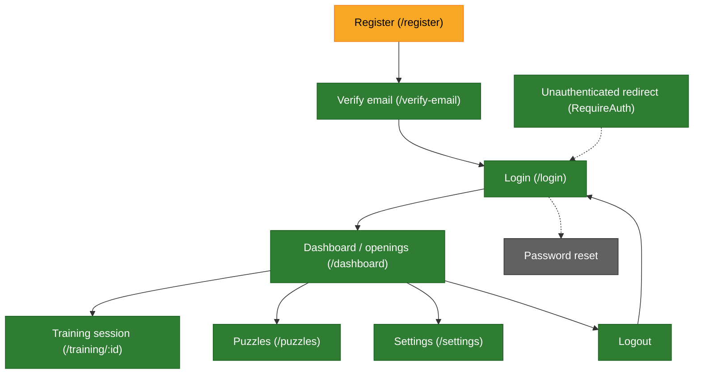

# E2E test coverage tracker

Playwright specs live in this directory. This doc maps the app's key user
flows (from `src/App.tsx` routes) to existing coverage and flags gaps.
Recorded videos for the interactive gap-flow tests live in `e2e/videos/`.

## Flow map

Legend: 🟢 covered · 🟡 partial (loads/screenshots only, weak interaction coverage) · 🔴 gap (no test) · ⚪ feature not built.

## Flows and coverage

| Flow | Route(s) | Covered by | Notes |
|---|---|---|---|
| Register | `/register` | `playwright-prod-register.spec.ts` | One-off, prod-only, creates the persistent smoke account. Not run in regular suite. |
| Login | `/login` | `playwright-prod-smoke.spec.ts`, `playwright-auth-and-flows.spec.ts` | Smoke test exercises the happy path to reach the dashboard; auth-and-flows spec covers the invalid-credentials error path (video: `login-invalid-credentials.webm`). |
| Email verification | `/verify-email` | `playwright-auth-and-flows.spec.ts` | Success (`email-verification-success.webm`) and invalid/expired token (`email-verification-error.webm`) states, mocked. |
| Logout | (Header action) | `playwright-auth-and-flows.spec.ts` | Clicks logout, confirms redirect to `/login` (video: `logout-redirect.webm`). |
| Dashboard / openings browse | `/dashboard` | `playwright-dashboard.spec.ts`, `playwright-auth-and-flows.spec.ts` (accessibility) | Screenshot-only across breakpoints/themes with mocked APIs; no click-through-to-training interaction is asserted. Accessibility scan added (see below). |
| Start training session | `/training/:id` | `playwright-dashboard.spec.ts`, `playwright-auth-and-flows.spec.ts` | Dashboard spec is screenshot-only; auth-and-flows spec plays a real click-click move on the board (`e2e4`) and asserts correct-move feedback (video: `training-correct-move.webm`). Session-completion/advance-to-next-item still untested. |
| Puzzles | `/puzzles` | `playwright-prod-smoke.spec.ts`, `playwright-auth-and-flows.spec.ts` | Smoke test confirms the board renders; auth-and-flows spec attempts a wrong move and asserts incorrect-move feedback (video: `puzzle-wrong-move.webm`). Correct-answer path still untested. |
| Settings / preferences | `/settings` | `playwright-settings-preview-check.spec.ts`, `playwright-auth-and-flows.spec.ts` | Preview spec covers board theme, piece set, coordinates, orientation toggle live; auth-and-flows spec confirms a changed board theme persists across a page reload via the backend (video: `settings-persistence.webm`). |
| Password reset / forgot password | n/a | none | Feature not yet built (tracked in memory `project_remaining_work_punchlist`). No route exists to test. |
| Route protection (unauthenticated access) | any protected route | `playwright-auth-and-flows.spec.ts` | Confirms hitting `/dashboard` while logged out redirects to `/login` (video: `unauthenticated-redirect.webm`). Only `/dashboard` is exercised directly; `/puzzles`, `/settings`, `/training/:id` share the same `RequireAuth` guard but aren't individually asserted. |
| Accessibility | `/login`, `/dashboard` | `playwright-auth-and-flows.spec.ts` | Automated `@axe-core/playwright` scan (WCAG 2 A/AA rules) on both pages (videos: `accessibility-login.webm`, `accessibility-dashboard.webm`). Not a substitute for manual screen-reader/keyboard testing, and only these two pages are scanned so far. |

## Summary of remaining gaps

1. Puzzle **correct**-answer path (only the wrong-move path is covered).
2. Training session completion / advancing through multiple items.
3. Accessibility scan coverage for `/training/:id`, `/puzzles`, `/settings`, `/register`, `/verify-email`.
4. Route-guard coverage for `/puzzles`, `/settings`, `/training/:id` individually (currently only `/dashboard` is asserted against `RequireAuth`).

## Findings from writing these tests

### Login-error path bug (fixed)

`src/api.ts`'s response interceptor used to retry **any** 401 through
`POST /auth/refresh` before giving up, including a 401 from `/auth/login`
itself. With no `refresh_token` in localStorage (the normal case for someone
who's never logged in), the refresh attempt threw synchronously and the
interceptor hard-navigated to `/login`, which could wipe out the
just-rendered "Invalid credentials" error before the user read it. Fixed by
skipping the refresh-retry when the failing request's URL is itself
`/auth/login`, `/auth/register`, or `/auth/refresh`. The auth-and-flows spec's
login-error test no longer needs to seed a fake `refresh_token`.

### Dashboard bugs unmasked by the interceptor fix (fixed)

Fixing the login-error navigation bug above surfaced two previously hidden
bugs on the dashboard a11y scan: it calls `/puzzles/summary`, which the test
didn't mock, so it hit the real backend, got a real 401, and the (buggy)
interceptor hard-navigated away mid-scan — masking real failures underneath.
Once the interceptor was fixed and the mock added, the scan ran to completion
and found:

1. `.progress-group-label` (the "Training"/"Puzzles" section headings) used
   `opacity: 0.7` on `var(--text)`, giving 3.99:1 contrast (below the 4.5:1 AA
   minimum). Fixed by raising it to `0.85` (~5.9:1).
2. `.dashboard-greeting` ("Good afternoon, ...") used `opacity: 0.75`, giving
   4.34:1 — also fixed by raising it to `0.85`.
3. `.dashboard-greeting` also had `role="heading"` without a required
   `aria-level`, an `aria-required-attr` violation. Fixed by adding
   `aria-level={1}`.

Both opacity fixes are in `packages/shared-styles/dashboard.css`; the
aria-level fix is in `src/pages/Dashboard.tsx`.

Consolidating the specs' duplicate `mockAuth` helpers into `auth-helpers.ts`
(which seeds a `token`, unlike the old per-file dashboard/settings versions)
surfaced the same missing-mock bug a third time in
`playwright-dashboard.spec.ts`: its dashboard screenshot tests never mocked
`/api/puzzles/summary`, so once a token was present the interceptor's
refresh-and-redirect path fired mid-render. Fixed by adding the mock there
too.

### A real accessibility violation (excluded, not fixed)

The `@axe-core` scan flags `.site-header-version` (the small "dev" build-version
badge in the header) for insufficient color contrast (3.04 vs the WCAG AA
4.5:1 minimum for its font size). The accessibility tests `.exclude()` this
selector so the scan can still catch regressions elsewhere; the underlying
contrast issue is unfixed and should be picked up as a small CSS follow-up.
